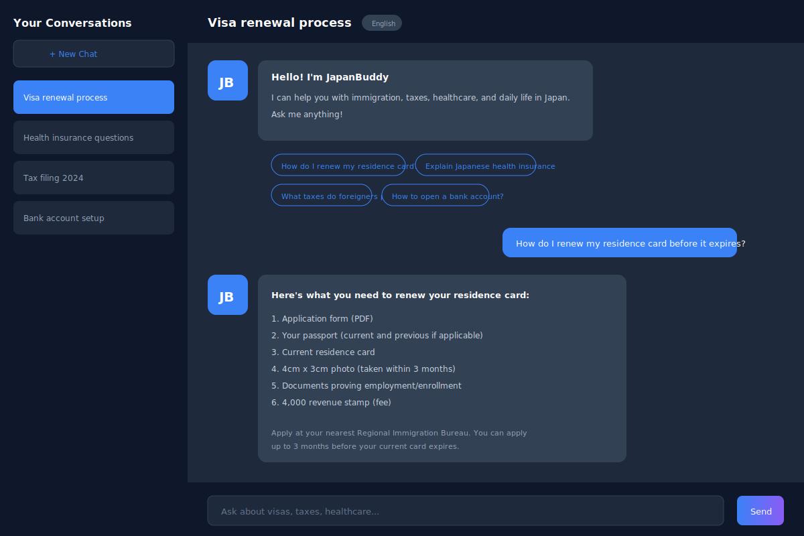
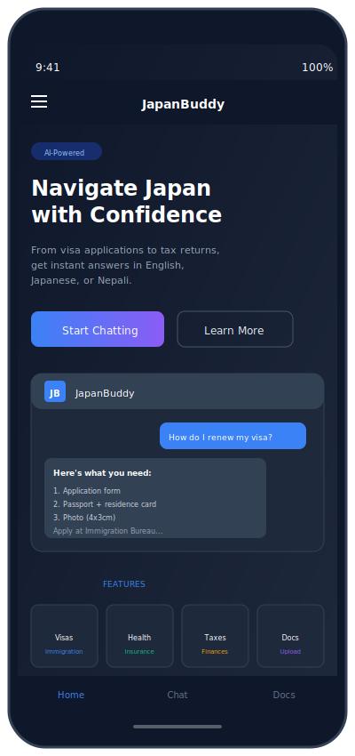

# JapanBuddy AI

**Your friendly AI assistant for navigating life in Japan.**

> 🇺🇸 Get instant answers about visas, taxes, health insurance, and more — in English, Japanese, or Nepali.
>
> 🇯🇵 日本での生活をサポートするAIアシスタント。ビザ、税金、健康保険などの質問に即座に回答します。
>
> 🇳🇵 जापानमा बस्नेहरूको लागि AI सहायक। भिसा, कर, स्वास्थ्य बीमाको बारेमा तुरुन्तै जवाफ पाउनुहोस्।

   

---

## Features / 機能 / विशेषताहरू

### AI-Powered Chat / AIチャット / AI च्याट
- **Multilingual Support** — Ask questions in English, Japanese (日本語), or Nepali (नेपाली)
- **Context-Aware Responses** — Uses RAG (Retrieval Augmented Generation) to provide accurate, document-backed answers
- **Real-time Chat** — Powered by Hotwire (Turbo Streams) for instant message updates
- **Smart Suggestions** — Quick-start prompts to help users get started

### Document Analysis / 書類分析 / कागजात विश्लेषण
- **Upload Official Documents** — PDF and TXT file support
- **Automatic Processing** — Documents are chunked and embedded using pgvector
- **Plain Language Explanations** — Get clear explanations of complex Japanese documents
- **Knowledge Base** — Build your personal knowledge base for better AI responses

### Topics Covered / 対応トピック / समावेश विषयहरू
- **Immigration & Visas** — Residence card renewals, visa status changes, work permits
- **Health Insurance** — National Health Insurance (NHI), Shakai Hoken, using Japanese healthcare
- **Taxes & Pension** — Filing tax returns, nenmatsu chosei, pension refunds for leaving Japan
- **Daily Life** — Setting up utilities, bank accounts, city hall procedures

### User Experience / ユーザー体験 / प्रयोगकर्ता अनुभव
- **Responsive Design** — Works on desktop and mobile
- **Dark/Light Mode** — Toggle between themes
- **Language Switcher** — Switch interface language instantly (EN/JP/NE)
- **Conversation History** — Access your previous chats anytime

---

## Tech Stack

| Category | Technology |
|----------|------------|
| **Framework** | Ruby on Rails 7.1 |
| **Database** | PostgreSQL 15+ with pgvector |
| **Frontend** | Hotwire (Turbo + Stimulus), Tailwind CSS |
| **AI/ML** | OpenAI API, Langchain.rb |
| **Authentication** | Devise |
| **File Storage** | ActiveStorage |

---

## Getting Started

### Prerequisites

- Ruby 3.2+
- PostgreSQL 15+ with pgvector extension
- Node.js 18+
- OpenAI API key

### Installation

1. **Clone the repository**
   ```bash
   git clone https://github.com/mandilkhadka/JapanBuddy-Ai.git
   cd JapanBuddy-Ai
   ```

2. **Install dependencies**
   ```bash
   bundle install
   yarn install
   ```

3. **Setup environment variables**
   ```bash
   cp .env.example .env
   ```

   Add your API keys to `.env`:
   ```
   OPENAI_API_KEY=your_openai_api_key
   DATABASE_URL=postgres://localhost/japanbuddy_development
   ```

4. **Setup the database**
   ```bash
   rails db:create
   rails db:migrate
   rails db:seed
   ```

5. **Start the server**
   ```bash
   bin/dev
   ```

6. **Visit the app**
   Open [http://localhost:3000](http://localhost:3000) in your browser.

---

## Project Structure

```
app/
├── controllers/
│   ├── conversations_controller.rb    # Chat management
│   ├── chat_messages_controller.rb    # Message handling
│   ├── documents_controller.rb        # Document uploads
│   └── pages_controller.rb            # Static pages
├── models/
│   ├── user.rb                        # User authentication
│   ├── conversation.rb                # Chat conversations
│   ├── chat_message.rb                # Individual messages
│   ├── document.rb                    # Uploaded documents
│   └── chunk.rb                       # Document chunks with embeddings
├── services/
│   ├── ai_answer_service.rb           # RAG-powered AI responses
│   ├── embedding_service.rb           # Vector embeddings
│   └── document_processor_service.rb  # Document chunking
├── javascript/controllers/
│   ├── chat_controller.js             # Chat interactions
│   ├── dropdown_controller.js         # Dropdown menus
│   └── theme_controller.js            # Dark/light mode
└── views/
    ├── pages/home.html.erb            # Landing page
    ├── conversations/                  # Chat views
    └── documents/                      # Document views
```

---

## Internationalization (i18n) / 多言語対応 / बहुभाषिक समर्थन

JapanBuddy supports three languages with full UI localization:

| Language | Code | File | Native Name |
|----------|------|------|-------------|
| English | `en` | `config/locales/en.yml` | English |
| Japanese | `ja` | `config/locales/ja.yml` | 日本語 |
| Nepali | `ne` | `config/locales/ne.yml` | नेपाली |

### Language Switcher / 言語切替 / भाषा परिवर्तन

Users can switch languages instantly using the language dropdown in the navigation bar. The entire UI updates in real-time without page reload.

**Example Use Cases in All Languages:**

| Use Case | English | 日本語 | नेपाली |
|----------|---------|--------|--------|
| Asking about visa | "How do I extend my work visa?" | "就労ビザの延長方法は？" | "मेरो कार्य भिसा कसरी विस्तार गर्ने?" |
| Health question | "Which hospital accepts foreign insurance?" | "外国の保険が使える病院は？" | "कुन अस्पताल विदेशी बीमा स्वीकार्छ?" |
| Tax inquiry | "When is the tax filing deadline?" | "確定申告の締切はいつ？" | "कर फाइलिङको अन्तिम मिति कहिले हो?" |

To add a new language, create a new YAML file in `config/locales/` and add the locale to the application configuration.

---

## API Integration

### OpenAI
The app uses OpenAI's API for:
- **Chat Completions** — GPT-4 for generating responses
- **Embeddings** — text-embedding-ada-002 for document vectors

### RAG (Retrieval Augmented Generation)
1. User asks a question
2. Question is converted to an embedding vector
3. Similar document chunks are retrieved using pgvector
4. Context + question is sent to GPT-4
5. AI generates a contextual, accurate response

---

## Screenshots

### Home Page / ホームページ / गृहपृष्ठ
The landing page introduces JapanBuddy's features with a clean, modern design supporting dark mode.


### Chat Interface / チャット画面 / च्याट इन्टरफेस
Real-time AI chat with message history, quick suggestions, and multilingual support.



### Documents / 書類管理 / कागजात व्यवस्थापन
Upload PDFs or paste text to build your personal knowledge base for AI-powered answers.


### Mobile View / モバイル表示 / मोबाइल दृश्य
Fully responsive design that works seamlessly on mobile devices.



---

## UI Translations / UIの翻訳 / UI अनुवाद

JapanBuddy supports **English**, **Japanese (日本語)**, and **Nepali (नेपाली)**. Here's how key UI elements appear in each language:

### Navigation / ナビゲーション / नेभिगेसन

| English | 日本語 (Japanese) | नेपाली (Nepali) |
|---------|------------------|-----------------|
| Home | ホーム | गृहपृष्ठ |
| Chat | チャット | च्याट |
| Documents | 書類 | कागजातहरू |
| Sign In | ログイン | लग इन |
| Sign Up | 無料で始める | निःशुल्क सुरु गर्नुहोस् |
| Sign Out | ログアウト | लग आउट |
| Language | 言語 | भाषा |
| Menu | メニュー | मेनु |

### Home Page / ホームページ / गृहपृष्ठ

| English | 日本語 (Japanese) | नेपाली (Nepali) |
|---------|------------------|-----------------|
| Navigate Japan with Confidence | 日本での生活、もう迷わない | जापानमा जीवन अब सजिलो |
| AI-Powered Assistant | AI搭載アシスタント | AI सहायक |
| Start Chatting | チャットを始める | च्याट सुरु गर्नुहोस् |
| Learn More | 詳しく見る | कसरी काम गर्छ हेर्नुहोस् |

### Features / 機能 / विशेषताहरू

| Feature | English | 日本語 | नेपाली |
|---------|---------|--------|--------|
| **Immigration** | Immigration & Visas | 在留資格・ビザ | भिसा र निवास |
| **Health** | Health Insurance | 健康保険 | स्वास्थ्य बीमा |
| **Taxes** | Taxes & Finances | 税金・年金 | कर र पेन्सन |
| **Documents** | Document Help | 書類サポート | कागजात मद्दत |

### Chat Interface / チャット / च्याट

| English | 日本語 (Japanese) | नेपाली (Nepali) |
|---------|------------------|-----------------|
| New Chat | 新規チャット | नयाँ च्याट |
| Your Conversations | チャット履歴 | च्याट इतिहास |
| Send | 送信 | पठाउनुहोस् |
| Thinking... | 考え中... | सोचिरहेको छ... |
| Hello! I'm JapanBuddy | こんにちは！JapanBuddyです | नमस्ते! म JapanBuddy हुँ |

### Quick Suggestions / クイック質問 / द्रुत प्रश्नहरू

| English | 日本語 | नेपाली |
|---------|--------|--------|
| How do I renew my residence card? | 在留カードの更新方法は？ | निवास कार्ड कसरी नवीकरण गर्ने? |
| Explain Japanese health insurance | 日本の健康保険について教えて | जापानको स्वास्थ्य बीमा बारे बताउनुहोस् |
| What taxes do foreigners pay? | 外国人の税金について | विदेशीहरूले कति कर तिर्नुपर्छ? |
| How to open a bank account? | 銀行口座の開設方法は？ | बैंक खाता कसरी खोल्ने? |

### Documents / 書類 / कागजातहरू

| English | 日本語 (Japanese) | नेपाली (Nepali) |
|---------|------------------|-----------------|
| Your Documents | アップロードした書類 | मेरा कागजातहरू |
| Upload Document | 書類をアップロード | कागजात अपलोड |
| Processing | 処理中 | प्रक्रियामा |
| Ready | 完了 | तयार |
| Upload & Analyze | アップロードして分析 | अपलोड गरी विश्लेषण गर्नुहोस् |

### Common Phrases / よく使うフレーズ / सामान्य वाक्यहरू

| English | 日本語 | नेपाली |
|---------|--------|--------|
| Welcome back! | おかえりなさい！ | फेरि स्वागत छ! |
| See you next time! | またのご利用をお待ちしています！ | फेरि भेटौंला! |
| Something went wrong | エラーが発生しました | केही समस्या भयो |
| Please sign in | ログインしてください | कृपया लग इन गर्नुहोस् |

---

## Roadmap

- [x] Core AI chat functionality
- [x] Document upload and processing
- [x] RAG-powered responses
- [x] Multilingual support (EN/JP/NE)
- [x] Dark/light mode
- [x] Responsive design
- [ ] Google Calendar integration for deadlines
- [ ] Community tips sharing
- [ ] Admin analytics dashboard
- [ ] Mobile app (React Native)

---

## Contributing

Contributions are welcome! Please feel free to submit a Pull Request.

1. Fork the repository
2. Create your feature branch (`git checkout -b feature/AmazingFeature`)
3. Commit your changes (`git commit -m 'Add some AmazingFeature'`)
4. Push to the branch (`git push origin feature/AmazingFeature`)
5. Open a Pull Request

---

## License

This project is licensed under the MIT License - see the [LICENSE](LICENSE) file for details.

---

## Acknowledgments

- Built for expats navigating life in Japan
- Powered by OpenAI's GPT-4 and embedding models
- UI inspired by modern SaaS applications

---

## Contact

**Mandil Khadka** — [@mandilkhadka](https://github.com/mandilkhadka)

Project Link: [https://github.com/mandilkhadka/JapanBuddy-Ai](https://github.com/mandilkhadka/JapanBuddy-Ai)
