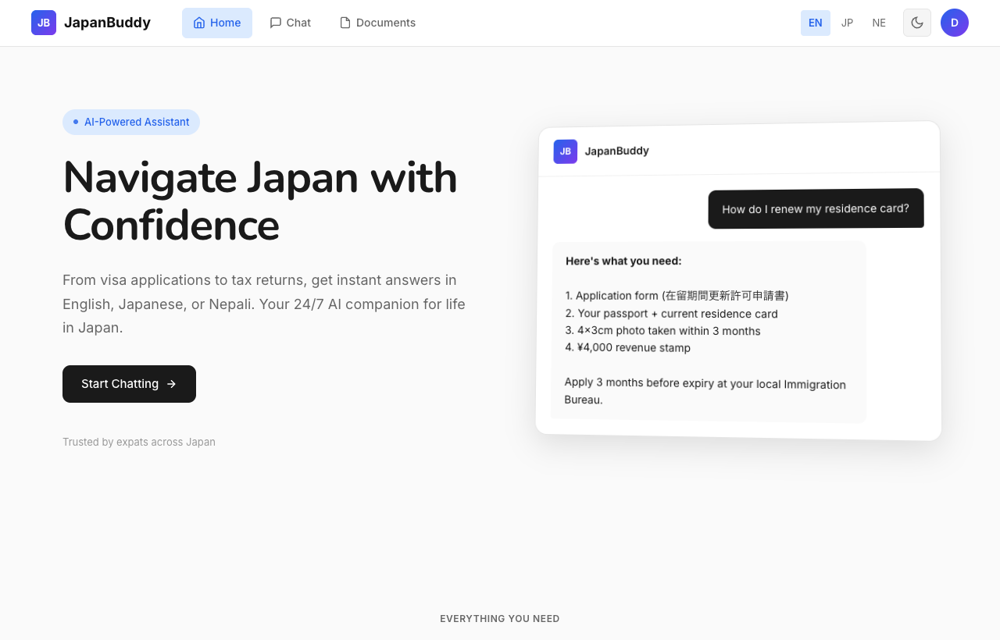

# JapanBuddy AI

**Your friendly AI assistant for navigating life in Japan.**

> 🇺🇸 Get instant answers about visas, taxes, health insurance, and more — in English, Japanese, or Nepali.
>
> 🇯🇵 日本での生活をサポートするAIアシスタント。ビザ、税金、健康保険などの質問に即座に回答します。
>
> 🇳🇵 जापानमा बस्नेहरूको लागि AI सहायक। भिसा, कर, स्वास्थ्य बीमाको बारेमा तुरुन्तै जवाफ पाउनुहोस्।

   

---



## Features / 機能 / विशेषताहरू

### AI-Powered Chat / AIチャット / AI च्याट
- **Multilingual Support** — Ask questions in English, Japanese (日本語), or Nepali (नेपाली)
- **Context-Aware Responses** — Uses RAG (Retrieval Augmented Generation) to provide accurate, document-backed answers
- **Real-time Chat** — Powered by Hotwire (Turbo Streams) for instant message updates
- **Smart Suggestions** — Quick-start prompts to help users get started

### Document Analysis / 書類分析 / कागजात विश्लेषण
- **Upload Official Documents** — PDF and TXT file support
- **Automatic Processing** — Documents are chunked and embedded using pgvector
- **Plain Language Explanations** — Get clear explanations of complex Japanese documents
- **Knowledge Base** — Build your personal knowledge base for better AI responses

### Topics Covered / 対応トピック / समावेश विषयहरू
- **Immigration & Visas** — Residence card renewals, visa status changes, work permits
- **Health Insurance** — National Health Insurance (NHI), Shakai Hoken, using Japanese healthcare
- **Taxes & Pension** — Filing tax returns, nenmatsu chosei, pension refunds for leaving Japan
- **Daily Life** — Setting up utilities, bank accounts, city hall procedures

---

## Tech Stack

| Category | Technology |
|----------|------------|
| **Framework** | Ruby on Rails 7.1 |
| **Database** | PostgreSQL 15+ with pgvector |
| **Frontend** | Hotwire (Turbo + Stimulus), Tailwind CSS |
| **AI/ML** | OpenAI API, Langchain.rb |
| **Authentication** | Devise |
| **File Storage** | ActiveStorage |

---

## Getting Started

### Prerequisites

- Ruby 3.2+
- PostgreSQL 15+ with pgvector extension
- Node.js 18+
- OpenAI API key

### Installation

1. **Clone the repository**
   ```bash
   git clone https://github.com/mandilkhadka/JapanBuddy-Ai.git
   cd JapanBuddy-Ai
   ```

2. **Install dependencies**
   ```bash
   bundle install
   yarn install
   ```

3. **Setup environment variables**
   ```bash
   cp .env.example .env
   ```

   Add your API keys to `.env`:
   ```
   OPENAI_API_KEY=your_openai_api_key
   DATABASE_URL=postgres://localhost/japanbuddy_development
   ```

4. **Setup the database**
   ```bash
   rails db:create
   rails db:migrate
   rails db:seed
   ```

5. **Start the server**
   ```bash
   bin/dev
   ```

6. **Visit the app**
   Open [http://localhost:3000](http://localhost:3000) in your browser.

---

## Project Structure

```
app/
├── controllers/
│   ├── conversations_controller.rb    # Chat management
│   ├── chat_messages_controller.rb    # Message handling
│   ├── documents_controller.rb        # Document uploads
│   └── pages_controller.rb            # Static pages
├── models/
│   ├── user.rb                        # User authentication
│   ├── conversation.rb                # Chat conversations
│   ├── chat_message.rb                # Individual messages
│   ├── document.rb                    # Uploaded documents
│   └── chunk.rb                       # Document chunks with embeddings
├── services/
│   ├── ai_answer_service.rb           # RAG-powered AI responses
│   ├── embedding_service.rb           # Vector embeddings
│   └── document_processor_service.rb  # Document chunking
├── javascript/controllers/
│   ├── chat_controller.js             # Chat interactions
│   ├── dropdown_controller.js         # Dropdown menus
│   └── theme_controller.js            # Dark/light mode
└── views/
    ├── pages/home.html.erb            # Landing page
    ├── conversations/                  # Chat views
    └── documents/                      # Document views
```

---

## Internationalization (i18n) / 多言語対応 / बहुभाषिक समर्थन

JapanBuddy supports three languages with full UI localization:

| Language | Code | File | Native Name |
|----------|------|------|-------------|
| English | `en` | `config/locales/en.yml` | English |
| Japanese | `ja` | `config/locales/ja.yml` | 日本語 |
| Nepali | `ne` | `config/locales/ne.yml` | नेपाली |


## API Integration

### OpenAI
The app uses OpenAI's API for:
- **Chat Completions** — GPT-4 for generating responses
- **Embeddings** — text-embedding-ada-002 for document vectors

## Roadmap

- [x] Core AI chat functionality
- [x] Document upload and processing
- [x] RAG-powered responses
- [x] Multilingual support (EN/JP/NE)
- [x] Dark/light mode
- [x] Responsive design
- [ ] Google Calendar integration for deadlines
- [ ] Community tips sharing
- [ ] Admin analytics dashboard
- [ ] Mobile app (React Native)

---
